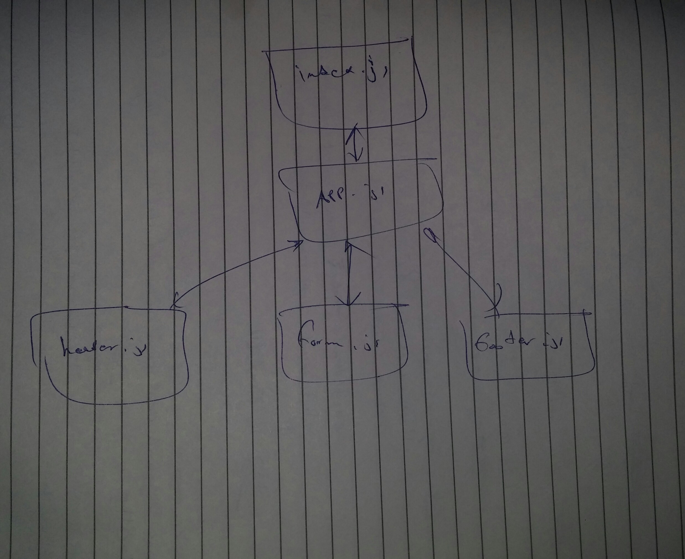

# lab-05

## RESTy

### Author: Yousef AlShun

### Links and Resources

- [class17 PR](https://github.com/yousef-401-advanced-javascript/resty
/pull/1)
<!-- - [swaggerHub URL](https://app.swaggerhub.com/apis/yousef-97/AOS2-allmethods/0.1)
- [Heroku Deployment](https://api-serverapp.herokuapp.com/api/v1/products) -->
<!-- - [github Action](https://github.com/yousef-401-advanced-javascript/caps/actions) -->

### Documentation
<!-- [jsdoc](https://api-serverapp.herokuapp.com/docs) -->

### Modules
<!-- - `express` -->
<!-- - `supertest` -->
<!-- - `mongoose` -->
<!-- - `morgan` -->
<!-- - `base-64` -->
<!-- - `bcryptjs` -->
<!-- - `superagent` -->
<!-- - `jsonwebtoken` -->
<!-- - `events (first party lib)` -->
<!-- - `net (first party lib)` -->

<!-- ##### EXported Values and Methods -->

<!-- ##### `classes`
- input return objects 
- notes return the note value -->

### Setup

#### How to initialize/run your application
<!-- - nodemon  -->
- npm start

<!-- json-server --watch ./data/db.json -->

#### UML

